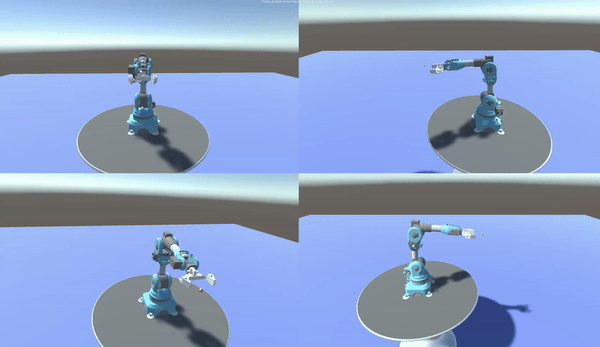
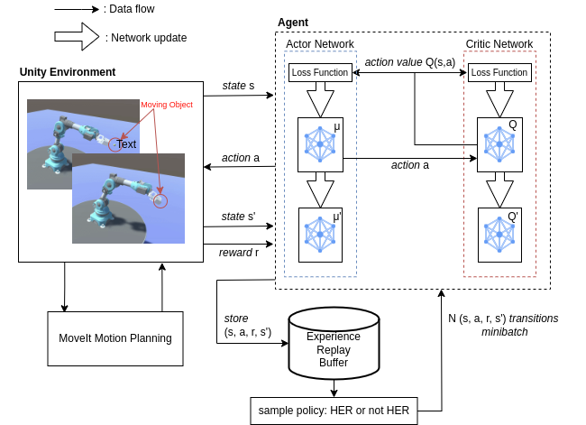

# RL-FloatGrasp

This repository contains the code for the paper "Reinforcement learning technique for grasping random floating object in 3D space with 6DOF robotic arm" by [K. Nguyen]. 

<p align="center">
    
</p>


The paper introduces a novel approach applying deep reinforcement learning to enable a robotic arm with 6 degrees of freedom to adeptly grasp a dynamically moving object within a 3D space, yielding superior outcomes over benchmark methods, as showcased through experimental validation in the Unity simulator. Below is the diagram of the proposed approach.

<p align="center">
    
</p>

For more information, please see: [https://rl-floatgrasp.github.io/](https://rl-floatgrasp.github.io/)

## Installation

### Build ROS MoveIt Motion Planning in Docker

On command line, run:
```bash
sudo docker build --no-cache -t unity-robotics:pick-and-place -f docker/Dockerfile .
```

## Run the training

Run the `unity-robotics:pick-and-place` Docker container:
```bash
sudo docker run -it --rm -p 10000:10000 unity-robotics:pick-and-place /bin/bash
```

When inside the container, launch `point_to_point` from the `niryo_moveit` package: 
```bash
roslaunch niryo_moveit point_to_point.launch
```

On command line, run to start the training:
```bash
python train.py --nsubsteps 15 \
                --max-timesteps 25 \
                --n-episodes 10 \
                --n-epochs 40 \
                --reward-type dense \
                --batch-size 1024 \
                --n-test-rollouts 10 \
                --polyak 0.9 \
                --file-name ./simulation/build/train/UnderwaterArm 
```

## Run the testing

On command line, run:
```bash
python test.py  --nsubsteps 15 \
                --max-timesteps 50 \
                --reward-type dense \
                --file-name ./simulation/build/UnderwaterArm \
                --load-dir RefinedUnderwaterEnv/model_default_2023-08-26-21-19-33.pt 
```
